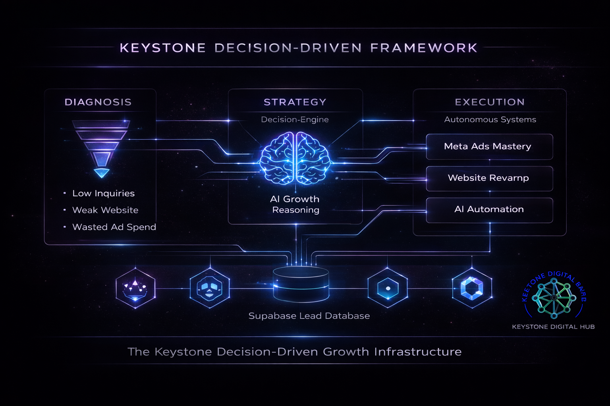

Keystone Growth Hub 🚀
The Decision-Driven AI Growth Infrastructure Built by Shahan-E-Ali | Growth Architect

🛠 Project Overview
Keystone Growth Hub is not just a landing page; it’s a high-conversion funnel designed to bridge the gap between AI creative, Meta Ads precision, and autonomous business workflows.

This repository houses the frontend and lead management system for the Keystone Digital Hub ecosystem, optimized for Zero-Cost Scaling using the Free-Tier stack.

🏗 Tech Stack
Frontend: Next.js (Tailwind CSS + Lucide Icons)

Deployment: Vercel (Free Tier)

Database: Supabase (PostgreSQL)

Logic: Keystone "Diagnosis > Strategy > Execution" Framework

📊 Database Schema (Supabase)
The project utilizes a leads table to capture high-intent inquiries:
| Column | Type | Description |
| :--- | :--- | :--- |
| id | UUID | Unique Identifier |
| name | Text | Client Name |
| email | Text | Contact Email |
| business_type | Text | Industry Niche |
| ad_budget | Numeric | Monthly Ad Spend |
| website_url | Text | Current Digital Asset |
| status | Text | Lead Lifecycle (New/Contacted) |

🚀 Key Features
Adaptive Lead Logic: Form behavior changes based on client budget (Efficiency vs. Scaling).

AI Toolbox Integration: Direct links to Keystone's proprietary Vercel-hosted tools.

Minimalist Aesthetic: Inspired by danielpaul.ai for a premium, technical feel.

Mobile First: Optimized for high-conversion on all devices.

📈 Strategic USP
Leads > Likes. Pretty ≠ Profit. We identify growth bottlenecks and build structured systems to ensure every dollar of ad spend delivers measurable ROI.

📩 Contact
Founder: Shahan-E-Ali

Portfolio: Keystone Digital Hub

Email: contact.keystonehub@gmail.com
